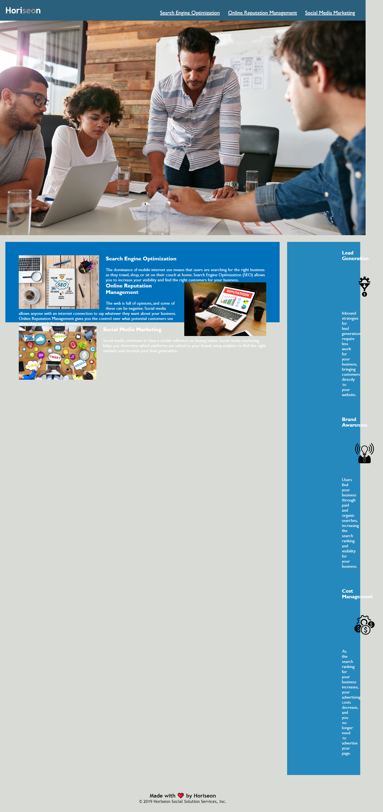

# Horiseon Website Refactoring
# Completed by Adam Kovacevich


## Refactored HTML & CSS code

```
AS A marketing agency Horiseon wanted a codebase that follows 
accessibility standards that would ensure their site is optimized for search engines.
```

```
Prior to my refactoring, Horiseon's HTML & CSS code was not formatted or organized correctly. 
There were various issues with broken links, incorrect element usage and formatting/layout issues. 
See below for a screenshot of the original broken website landing page below.
```
```md

```

## List of webpage corrections

> **Adam's Note**: I have refactored the HTML & CSS code. 
These changes have corrected the original HTML & CSS files 
so that the website looks and functions as intended per the original mockup screenshot below.

```md

```

```
The webpage now meets accessibility standards.
The HTML code has been corrected to best reflect semantic HTML Elements and Structure.
Icon and Image elements were realign properly to fit within their intended blocks. 
Icons & Images now have included alt attributes in the event the webpage does not fully load for consumers. 
Title Element has been included and functioning. 
All links are now included and functioning.
CSS file has been restructured, refactored and labeled appropriately for readability, accessibility of the webpage.
```

## Screenshot of newly refactored Horiseon Website.

>The following image is a screenshot of the newly refactored webpage. You may note that I choose not to change the text color in the "Horiseon" logo in the upper left corner of the website. The original Mockup has the "seo" as the same white color of the logo. I would assume the branding/marketing department of this company intended for the separate color of those letters for it to 'stand-out'. SEO is an acronym for "Search Engine Optimization". Per the content of this website's landing page, I as a developer believe this was Branding/Marketing Department's intended coloration of the Horiseon logo.

```


```

## Please visit the following link to view and test the newly refactored Horiseon website.

```
Horiseon Website: https://kovaceva11.github.io/Horiseon-SEO-Website-Refactor/
My Github Portfolio Repo: https://github.com/Kovaceva11/Horiseon-SEO-Website-Refactor
```