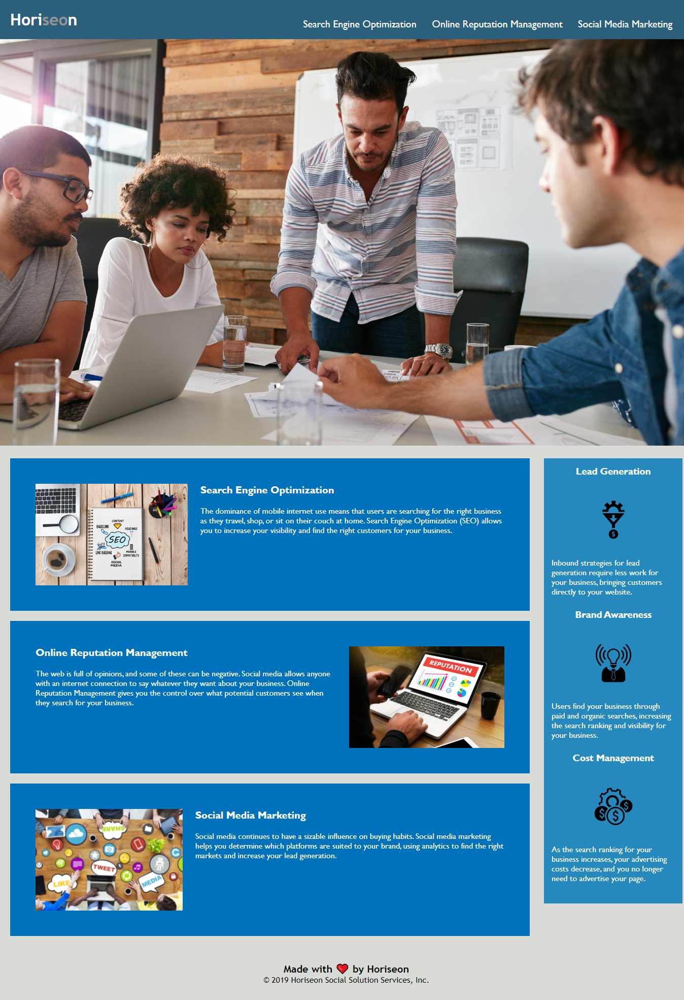

# 01 HTML, CSS, and Git: Code Refactor
# Homework Assignment Completed by Adam Kovacevich


## User Story

```
AS A marketing agency
I WANT a codebase that follows accessibility standards
SO THAT our own site is optimized for search engines
```
> **Adam's Note**: I have refactored the HTML & CSS code to the best of my ability. These changes have corrected the original HTML & CSS files so that the website looks and functions as intended per the original mockup screenshot below. 

## Acceptance Criteria

>**Adam's Note**: I had completed the code refactoring inside the "gt-atl-virt..." repository before creating a separate repository for this assignment. Therefore, the actual changes to the code may not be tracked properly within this repository. I will reference this to the TA & Instructor prior to submitting the assignment to the BootcampSpot Dashboard. 

```
GIVEN a webpage meets accessibility standards
WHEN I view the source code
THEN I find semantic HTML elements
WHEN I view the structure of the HTML elements
THEN I find that the elements follow a logical structure independent of styling and positioning
WHEN I view the icon and image elements
THEN I find accessible alt attributes
WHEN I view the heading attributes
THEN they fall in sequential order
WHEN I view the title element
THEN I find a concise, descriptive title
```

## Adam's Screenshot of [solved] Demo Site

>The following image is a screenshot of my completed homework assignment. You may note that I choose not to change the text color in the "Horiseon" logo in the upper left corner of the website. The original Mockup has the "seo" as the same white color of the logo. I would assume the branding/marketing department of this company intended for the separate color of those letters for it to 'stand-out'. SEO is an acronym for "Search Engine Optimization". Per the content of this website's landing page, I as a developer believe this was Branding/Marketing intended coloration of the Horiseon logo.


